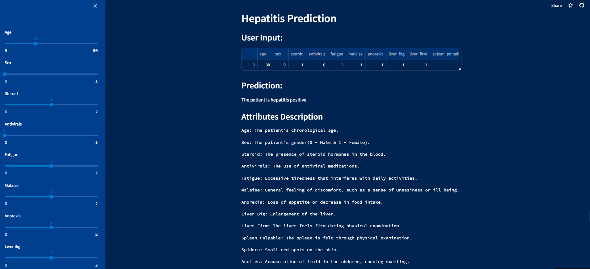

# Hepatitis Prediction Repository 
# Description
This repository contains the code for predicting the likelihood of developing hepatitis based on various health indicators. The model uses machine learning techniques to analyze historical patient data and predict potential outcomes.

You can visit the deployed project at:- [Link](https://hepatitis-prediction-app.streamlit.app/).


# Installation/Usage
To use the Hepatitis Prediction model, follow these steps:
- Clone the repository to your local machine.
  ```bash
  git clone https://github.com/ShrushtiDesai/Hepatitis_prediction.git
  ```
- Navigate to the cloned directory.
  ```bash
  cd Hepatitis_prediction
  ```
- Run the script to install all the requirements.
  ```bash
  pip install -r requirements.txt
  ```
- Run the script to launch the streamlit application.
  ```bash
  streamlit run streamlit_app.py
  ```
Please note that you may need to adjust the paths in the script to match your local environment.
# Contributing
Your contributions are welcome! Please feel free to fork the repository, make your changes, and submit a pull request.
